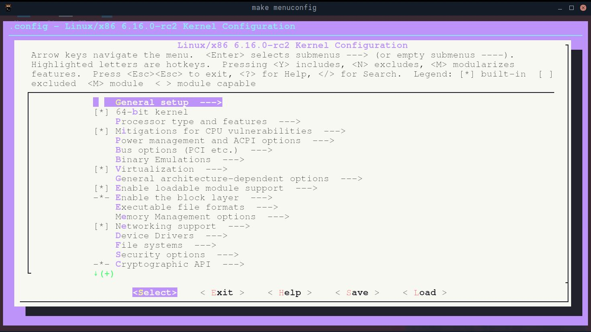
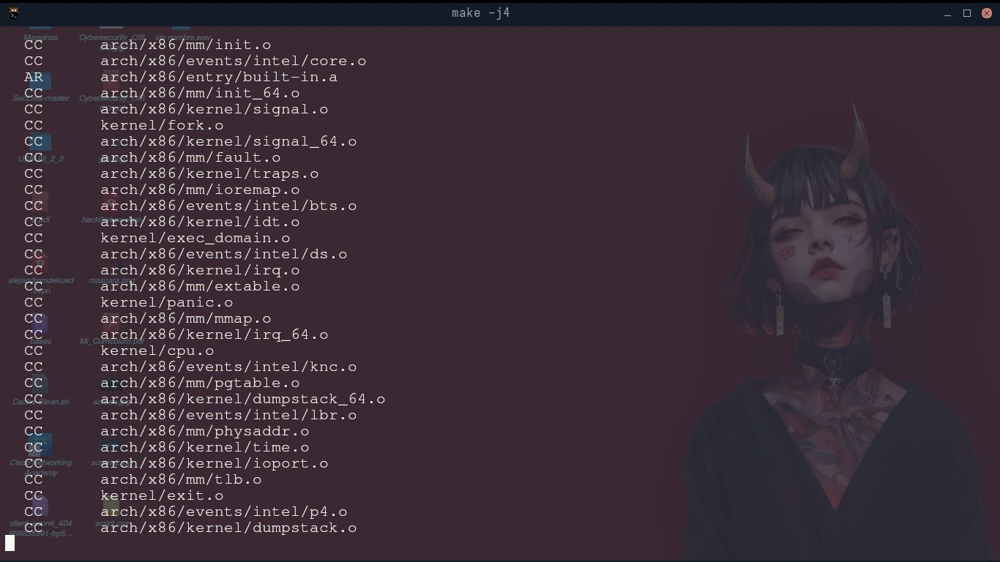
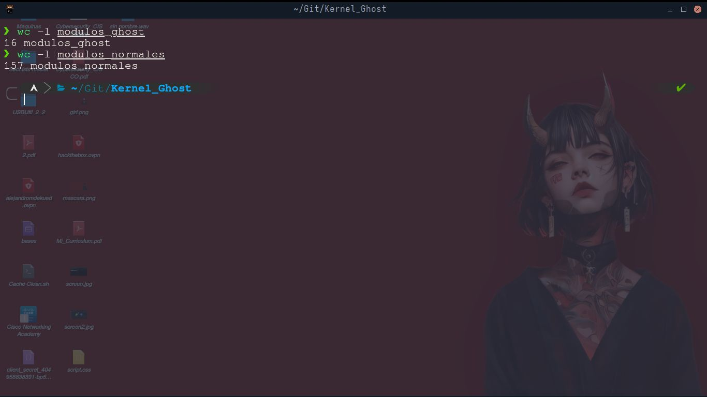
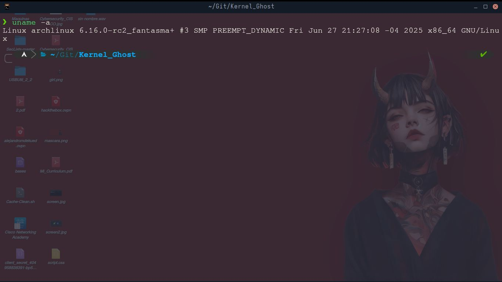

# Compilación y Opmitización de un Kernel Personalizado de Linux (Arch linux Fantasma)

Te voy a enseñar paso a paso como se compila un kernel personalizado de **Arch linux**, para lograr que sea minimalista, opmitizado y seguro, con menos superficie de ataque, haciendolo impenetrable, además de quitar utilidades depurativas que si bien son utiles, cuando se habla de pentesting suelen generar ruido, por lo que las herramientas son las que generaran el ruido no nuestro sistema base.

Decidí hacer este proyecto como una iniciativa para entender el funcionamiento de un sistema a bajo nivel aplicado al pentesting, compilando desde 0 un kernel de **linux** para un bajo consumo de recursos, menor superficie de ataque y mayor control, simulando un entorno fantasma 

## ¿Qué es un Kernel?

Primero que nada antes de compilar el **kernel** debemos saber que es, el **Kernel** es la capa de software encargada de conectar el **Hardware** con el **Software**, gestionando,protegiendo y controlando recursos, la memoria, los procesos, la red, el hardware..., todo pasa por el kernel, el kernel es el cerebro que controla todo el sistema.

## ¿Por Qué es importante Personalizarlo?

El kernel viene con muchos drivers, módulos, utilidades, y código que si bien nos podrían ser útiles la mayoría de las veces, no lo utilizamos, lo cual se convierte en una carga para el kernel, están hay pero no lo usamos, por ejemplo: módulos de drivers que no utilizamos y podrían tener vulnerabilidades, módulos obsoletos, sistemas de seguridad ruidosos, etc. Aquí nos centraremos en limpiar todo eso para que nuestro sistema sea minimalista y sin huellas dactilares.


# Preparativos

## 1. Actualizar sistema e instalar herramientas de compilación

	sudo pacman -Syu

	sudo pacman -S base-devel bc perl git make openssl cpio linux-headers

## 2. Clonar repositorio oficial  de Arch Linux

	git clone https://github.com/archlinux/linux.git

Este proceso tarda mucho, pero depende de tu dispositivo la velocidad con que realizará el proceso


## 3. Editar las configuraciones del kernel para que tenga las propiedades deseadas( Minimalista , seguro, Veloz y sin huellas dactilares )


### Comando para abrir el menú de configuraciones del kernel

Primero verifica si tu kernel tiene un archivo de configuración de tu kernel actual usando el siguiente comando:

	ls -a /boot/config-$(uname -r) 

Si el archivo existe copialo a la carpeta donde está el directorio del kernel de linux que clonastes desde **github**, suponiendo que estás en ese directorio, ejecuta el siguiente comando:

	cp /boot/config-$(uname -r) .

Luego asegurate de cargar ese archivo cuando ejecutes el siguiente comando.
Si no tienes el archivo no te preocupes ejecuta el siguiente comando para crearlo con las configuraciones 

	make menuconfig





### Controles

pulsa **"las flechas direccionales"** arriba y abajo para moverte en el menú de arriba, y hacia la izquierda y derecha para las opciones abajo, donde dice: exit,save,load...

Pulsa **"y"** para marcar una opción

pulsa **"n"** para desmarcarla

pulsa **m** para marcarla como módulo   (lós módulos son piezas de código que se puedan cargar y descargar con el kernel en ejecución, son como plugins para el kernel)

pulsa **"enter"** para entrar a un submenu

pulsa dos veces la tecla **ESC** para ir atrás


### Importante

Ve a **General Setup**, generalmente es la primera opción del menú
y busca esta configuración: **() Local version - append to kernel release**
aquí debes de colocarle un sufijo al kernel para diferenciarlo del que tienes instalado y evitar posible sobreescritura

yo lo edité con el nombre "fantasma", te debería de quedar el valor dentro de los paréntesis, así:

**(_fantasma) Local version - append to kernel release** 


#### Aquí Asegurate de desactivar todo lo que no sea esencial para el funcionamiento an la máquina:

* No instales **drivers** que no utilizaras

* **Opciones de seguridad** **"amigables"** pero detectables, algunos mecanismos de seguridad están diseñados para la **"seguridad corporativa"** y pueden generar ruido o ser explotados por adversarios.

* **Opciones de depuración que no sean esenciales** **Kernel Hacking Menú**, la idea es ser sigiloso, esto añade código extra al kernel que puede ser usado por un atacante para obtener información. 

* **Tracing/Profiling**: Desactivar todo lo relacionado con **tracing**, **profiling**, y **event tracing**(Menu de kernel Hacking). Estas son herramientas de análisis y monitoreo, pero para un kernel fantasma son un riesgo.

Estos son lo algunas de muchas configuraciones para el kernel, te invito a inverstigar y aprender de cada una de las configuraciones para el kernel para elegir las configuraciones que mejor se adapten a tu dispositivo.


# Compilación - La Forja

Cuando termines de configurar todo, selecciona guardar, todo esto se guardará en el **.conf**.

Aquí empezaremos a compilar el kernel ejecutando este comando:

	sudo make -j$(nproc)

**make** : Este comando es una utilidad que determina automaticamente que piezas de un programa necesitan ser recompiladas, en este caso recompilaremos el kernel de linux

**-js$(nproc)**: **-j** es un parametro utilizado para indicar el numero de trabajos o comandos a ejecutar paralelamente, y está cantidad la sacaremos del número de núcleos del cpu

Si desafortunadamente ocurre un error durante la compilación, ejecuta el comando ```make clean``` antes de volver a ejecutar el comando para compilar, esto eliminará archivos residuales generados anteriormente.





## Instalación de Módulos

Para instalar los módulos que seleccionaste anteriormente durante la configuración en **menuconfig**,debes de ejecutar el siguiente comando, si no lo haces producirá un error durante la instalación.

	sudo make modules_install


## Instalando Kernel Fantasma

Primero que nada ejecuta el comando:

	make kernelrelease

Para que conozcas la versión de tu kernel y anótala

### Si tu Gestor de Arranque es Grub:

Ejecuta el comando:

	sudo make install

Y se instalará el kernel compilado dentro del directorio **/boot**, añadiendo aquí los archivos **initramfs.img**, **System.map** y **vmlinuz**. Ahora tienes que generar el **initramfs** para arrancarcon el siguiente comando:

	sudo mkinitcpio -k $(make kernelrelease) -g /boot/initramfs-tu_kernel.img

**-k $(make kernelrelease)**: Obtiene la versión de tu kernel compilado

**-g /boot..."** : Aquí reemplaza **tu-kernel" con un nombre distintivo


#### Primer arranque ( Momento de la Verdad )


 
ejecuta:

	sudo pacman -Sy grub
	
	sudo grub-mkconfig -o /boot/grub/grub.cfg

Esto actualiza tu grub y escanea tu sistema en busca de kernels, actualizando así el menú de arranque de **Grub**, deberías de ver tu nuevo kernel listado

Y por ultimo **Reinicia** con 

	sudo reboot

Cuando tu maquina se reinicie deberías ver un menú de **Grub** y selecciona tu nuevo kernel 

	
### En mi caso

Mi **ArchLinux** no utiliza **grub** para arrancarlo, utiliza **systemd-boot** en su lugar, el cual es un loader minimalista.

Si también es tu caso, haz lo siguiente:

1. En la raiz del directorio del kernel de linux que clonamos ejecuta el comando:

	make kernelrelease

Este comando te dará la versión del kernel que compilaste

2. Estando dentro de la carpeta del kernel de linux que clonaste en **github** ejecuta los siguientes comandos:

	cd arch/x86/boot

**arch/** este directorio contiene código específico para cada arquitectura de **hardware** (x86,ARM...)

**x86** Aunque diga x86 que suele relacionarse con sistemas de 32bits, no te preocupes si tienes un sistema de 64bits es lo mismo, linux no tiene directorios únicos para cada uno

Una vez dentro del directorio, copiamos el archivo llamado **bzImage** el cual es el archivo vmlinuzque necesitamos.

	sudo cp bzImage /boot/vmlinuz-linux-<Versión de tu kernel>


Reemplaza versión de tu kernel con el output del comando ```make kernelreleaase```, entonces ya estaría copiado vmlinuz, ahora nos falta el archivo **initramfs**, para generarlo ejecutaresmos el siguiente comando en la raiz del directorio del kernel de linux que clonamos:

	sudo mkinitcpio -P linux-fantasma

Este comando creará el initramfs y el parámetro **-P** nos permite colocarle un nombre, posteriormente verificamos que los dos archivos que acabamos de crear estén en la carpeta **boot/** con el nombre que le dimos. Por ejemplo: **vmlinuz-linux-6.16.0-rc2_fantasma+**


Por último, nos dirigimos al directorio: **/boot/loader/entries**, y copiamos el archivo que esté ahí, pueden que haya uno o dos, copia cualquiera de estos con un nombre distintivo, por ejemplo:

	sudo cp linux.conf arch-linux-fantasma.conf

Luego lo abrimos ejecutando **nano** o con un editor de tu preferencia

	```sudo nano arch-linux-fantasma.conf``` 

Deberías ver algo como esto:

	# Created by: archinstall
	# Created on: 2025-04-19_22-46-15
	title   Arch Linux (linux)
	linux   /vmlinuz-linux
	initrd  /initramfs-linux.img
	options root=PARTUUID=e1269ccb-f129-4ef2-886a-ead7297e40d4 zswap.enabled=0 rw rootfstype=ext4


Debemos reemplazar:

**title**: con un nombre de tu preferencia, este nombre será el que se mostrará cuando inicies tu PC y eligas el kernel

**linux**: aquí coloca la ruta del archivo **vmlinuz-linux** de tu kernel fantasma

**initrd**: dirección del archivo **initramfs** de tu kernel


Debería de quedar algo así:

	title Arch Linux (Kernel Fantasma)
	linux /vmlinuz-linux-6.16.0-rc2_fantasma+.efi
	initrd /initramfs-linux6.16.0-rc2_fantasma+.img
	options root=PARTUUID=e1269ccb-f129-4ef2-886a-ead7297e40d4 zswap.enabled=0 rw rootfstype=ext4


Y ya tendríamos configurado nuestro kernel fantasma, para probarlo reinicia tu pc y elige el nuevo kernel, y verifica si te funciona

## Verificación Post-Arranque


* Usa el comando ```uname -a``` para ver si coincide con la versión de tu kernel fantasma

* Compara lsmod de tu fantasma vs tu versión normal de Arch

* Compara free -h de tu kernel fantasma vs Arch normal

* Compara los tamaños de **initramfs** y **vmlinuz** de tu kernel fantasma con la versiones normales de **Arch**




**Mira: el kernel fantasma solo usa 16 módulos, mientras que la versión normal ocupa 157, lo cual significa alta eficiencia y minimalismo**




**Aquí vemos la versión del kernel, significa que estamos utilizando nuestro nuevo kernel y por lo tanto el proceso fue exitoso**


## Explorando initramfs

Ahora exploraremos el contenido del **initramfs**, copiaremos los dos initramfs, el normal y el fantasma a nuestro directorio de trabajo actual.

	
	mkdir init_normal
	mkdir init_fantasma
	cp /boot/initramfs-linux.img ./init_normal/
	cp /boot/initramfs-linux6.16.0-rc2_fantasma+.img ./init_fantasma

Lo extraemos (si llegas a tener un problema durante la extracción ejecuta ```file nombre_archivo``` para verificar en que formato está comprimido y investiga como extraerlo)

	cpio -idmv initramfs-linux.img
	cpio -idmv initramfs-linux6.16.0-rc2_fantasma+.img

**cpio -idmv**: **(i)** Extrae, **(d)** crea directorios si es necesario, **(m)** sobreescribe existentes, **(verbose)** verbose.


Luego podemos explorar el contenido de cada uno de ellos, intenta ver el tamaño de cada uno de las carpetas con el comando ```free``` y te sorprenderas con la diferencia

 
